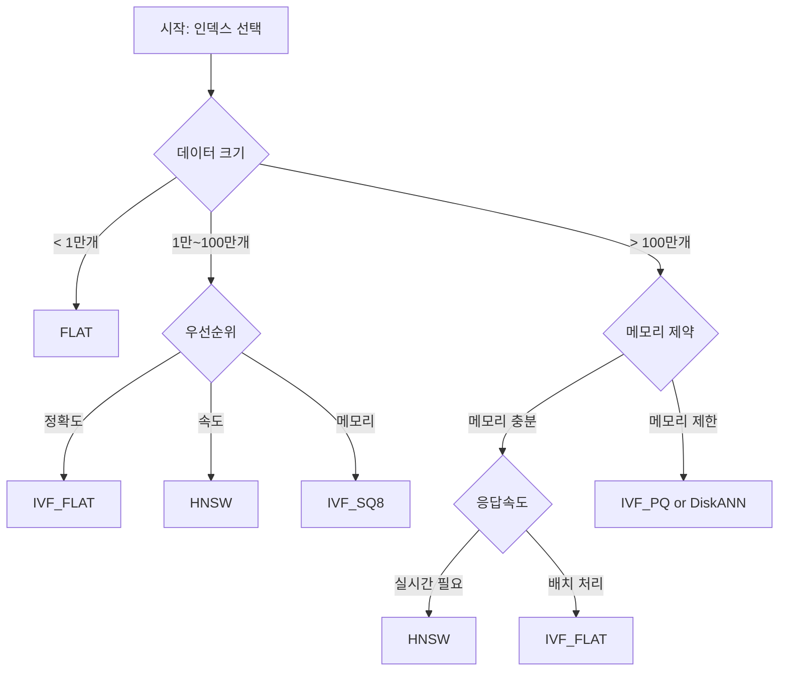

# Milvus 인덱스 타입 완전 가이드

## 개요

인덱스(Index)는 벡터 검색 성능을 크게 좌우하는 핵심 요소입니다. Milvus는 다양한 인덱스 타입을 제공하여 서로 다른 데이터 규모, 성능 요구사항, 메모리 제약 조건에 최적화된 검색을 지원합니다.

올바른 인덱스 선택은 검색 속도, 정확도, 메모리 사용량, 구축 시간 간의 균형을 맞추는 것이 핵심입니다.

## Milvus 인덱스 타입 분류

### 1. 정확도 기반 분류

#### 1.1 정확한 검색 (Exact Search)
- **FLAT**: 브루트 포스 검색, 100% 정확도

#### 1.2 근사 검색 (Approximate Search)
- **IVF 계열**: IVF_FLAT, IVF_SQ8, IVF_PQ
- **그래프 기반**: HNSW
- **고급 알고리즘**: SCANN, DiskANN

### 2. 메모리 사용량 기반 분류

#### 2.1 메모리 집약적
- **FLAT, IVF_FLAT, HNSW**: 원본 벡터 저장

#### 2.2 메모리 효율적
- **IVF_SQ8**: 8비트 양자화
- **IVF_PQ**: 곱 양자화
- **DiskANN**: 디스크 기반

## 상세 인덱스 타입 분석

### 1. FLAT (Brute Force)

#### 특징
- **알고리즘**: 브루트 포스 선형 검색
- **정확도**: 100% (완전 정확)
- **구축 시간**: 없음 (인덱스 구축 불필요)
- **메모리 사용량**: 원본 벡터 크기와 동일

#### 장점
```
✅ 완벽한 정확도 보장
✅ 인덱스 구축 시간 없음
✅ 구현이 단순하고 안정적
✅ 모든 유사도 메트릭 지원
```

#### 단점
```
❌ 검색 속도가 매우 느림 (선형 시간)
❌ 대용량 데이터에 비실용적
❌ 메모리 사용량이 많음
```

#### 최적 사용 사례
- **소규모 데이터** (1만 개 미만 벡터)
- **정확도가 절대적으로 중요한 경우**
- **개발/테스트 단계**
- **성능 벤치마크의 기준점**

### 2. IVF_FLAT (Inverted File with Flat)

#### 특징
- **알고리즘**: k-means 클러스터링 + 평면 검색
- **정확도**: 90-99% (nprobe 설정에 따라)
- **구축 시간**: 보통 (클러스터링 필요)
- **메모리 사용량**: 원본 벡터 + 클러스터 정보

#### 작동 원리
```
1. 훈련 단계: k-means로 벡터를 nlist개 클러스터로 분할
2. 인덱싱: 각 벡터를 가장 가까운 클러스터에 할당
3. 검색: nprobe개 클러스터만 탐색하여 후보 벡터 검색
```

#### 장점
```
✅ FLAT 대비 크게 향상된 검색 속도
✅ 정확도와 속도의 균형
✅ 모든 유사도 메트릭 지원
✅ 파라미터 조정으로 성능 튜닝 가능
```

#### 단점
```
❌ 클러스터링 시간 필요
❌ nlist, nprobe 파라미터 튜닝 필요
❌ 메모리 사용량이 여전히 높음
```

#### 파라미터 가이드
```python
index_params = {
    "index_type": "IVF_FLAT",
    "metric_type": "L2",  # or COSINE, IP
    "params": {
        "nlist": 1024,    # 클러스터 수 (일반적으로 4*sqrt(n))
    }
}

search_params = {
    "metric_type": "L2",
    "params": {
        "nprobe": 10,     # 탐색할 클러스터 수 (1 ≤ nprobe ≤ nlist)
    }
}
```

#### 최적 사용 사례
- **중간 규모 데이터** (10만~100만 벡터)
- **일반적인 검색 애플리케이션**
- **정확도와 속도의 균형이 필요한 경우**

### 3. IVF_SQ8 (Inverted File with Scalar Quantization)

#### 특징
- **알고리즘**: IVF + 8비트 스칼라 양자화
- **정확도**: 85-95% (양자화로 인한 손실)
- **구축 시간**: IVF_FLAT보다 약간 길음
- **메모리 사용량**: 원본의 약 25% (1/4로 압축)

#### 작동 원리
```
1. IVF_FLAT과 동일한 클러스터링
2. 각 벡터 차원을 8비트로 양자화
3. 메모리 사용량을 크게 줄임
```

#### 장점
```
✅ 메모리 사용량 대폭 감소 (75% 절약)
✅ IVF_FLAT 대비 빠른 검색 속도
✅ 캐시 효율성 향상
✅ 비용 효율적
```

#### 단점
```
❌ 양자화로 인한 정확도 손실
❌ 복원 불가능한 압축
❌ 매우 높은 정밀도가 필요한 경우 부적합
```

#### 최적 사용 사례
- **메모리 제약이 있는 환경**
- **중간 정도의 정확도로도 충분한 경우**
- **비용 최적화가 중요한 서비스**
- **대용량 데이터의 빠른 스크리닝**

### 4. IVF_PQ (Inverted File with Product Quantization)

#### 특징
- **알고리즘**: IVF + 곱 양자화 (Product Quantization)
- **정확도**: 80-90% (압축률에 따라)
- **구축 시간**: 가장 김 (복잡한 양자화)
- **메모리 사용량**: 원본의 1-10% (압축률 조정 가능)

#### 작동 원리
```
1. 벡터를 m개 서브벡터로 분할
2. 각 서브벡터를 독립적으로 양자화
3. 코드북을 사용해 매우 높은 압축률 달성
```

#### 장점
```
✅ 매우 높은 압축률 (90-99% 메모리 절약)
✅ 수억 개 벡터 처리 가능
✅ 확장성이 뛰어남
✅ 대용량 데이터에 최적화
```

#### 단점
```
❌ 가장 낮은 정확도
❌ 긴 인덱스 구축 시간
❌ 복잡한 파라미터 튜닝
❌ IP 메트릭만 지원
```

#### 파라미터 가이드
```python
index_params = {
    "index_type": "IVF_PQ",
    "metric_type": "IP",  # IP만 지원
    "params": {
        "nlist": 1024,   # 클러스터 수
        "m": 8,          # 서브벡터 수 (벡터 차원의 약수)
        "nbits": 8,      # 각 서브벡터의 비트 수
    }
}
```

#### 최적 사용 사례
- **대용량 데이터** (수억 개 벡터)
- **메모리/저장 비용이 매우 중요한 경우**
- **높은 정확도보다 빠른 스크리닝이 목적**
- **클라우드 환경에서 비용 최적화**

### 5. HNSW (Hierarchical Navigable Small World)

#### 특징
- **알고리즘**: 계층적 그래프 구조
- **정확도**: 95-99% (파라미터에 따라)
- **구축 시간**: 보통~김
- **메모리 사용량**: 원본 벡터 + 그래프 구조

#### 작동 원리
```
1. 다층 그래프 구조 구축
2. 상위 층에서 빠른 탐색
3. 하위 층에서 정밀 검색
4. 그리디 알고리즘으로 효율적 탐색
```

#### 장점
```
✅ 매우 빠른 검색 속도
✅ 높은 정확도 유지
✅ 실시간 애플리케이션에 적합
✅ 확장성 우수
```

#### 단점
```
❌ 높은 메모리 사용량
❌ 복잡한 그래프 구조
❌ 인덱스 구축 시간 김
❌ 파라미터 튜닝 복잡
```

#### 파라미터 가이드
```python
index_params = {
    "index_type": "HNSW",
    "metric_type": "L2",
    "params": {
        "M": 16,              # 최대 연결 수 (4-64)
        "efConstruction": 200, # 구축 시 탐색 범위
    }
}

search_params = {
    "metric_type": "L2",
    "params": {
        "ef": 64,  # 검색 시 탐색 범위 (> topK)
    }
}
```

#### 최적 사용 사례
- **실시간 검색 서비스**
- **낮은 지연시간이 중요한 경우**
- **높은 QPS (Query Per Second) 요구**
- **온라인 추천 시스템**

### 6. SCANN (Scalable Nearest Neighbors)

#### 특징
- **알고리즘**: Google의 SCANN 알고리즘
- **정확도**: 90-95%
- **구축 시간**: 보통
- **메모리 사용량**: 중간

#### 장점
```
✅ Google의 최신 연구 결과
✅ 균형잡힌 성능
✅ 안정적인 정확도
```

#### 최적 사용 사례
- **최신 알고리즘 활용**
- **연구 및 실험 목적**

### 7. DiskANN

#### 특징
- **알고리즘**: 디스크 기반 그래프 인덱스
- **정확도**: 90-95%
- **구축 시간**: 김
- **메모리 사용량**: 매우 낮음 (디스크 활용)

#### 장점
```
✅ 매우 낮은 메모리 사용량
✅ 대용량 데이터 처리 가능
✅ 비용 효율적
```

#### 단점
```
❌ 디스크 I/O로 인한 지연
❌ 복잡한 설정
```

#### 최적 사용 사례
- **메모리가 매우 제한적인 환경**
- **초대용량 벡터 데이터**
- **배치 처리 위주의 워크로드**

## 인덱스 선택 결정 트리



## 성능 비교표

### 1. 전체 비교

| 인덱스 | 정확도 | 검색속도 | 메모리사용량 | 구축시간 | 확장성 | 실시간성 |
|--------|--------|----------|-------------|----------|--------|----------|
| **FLAT** | ⭐⭐⭐⭐⭐ | ⭐ | ⭐ | ⭐⭐⭐⭐⭐ | ⭐ | ⭐ |
| **IVF_FLAT** | ⭐⭐⭐⭐ | ⭐⭐⭐ | ⭐⭐ | ⭐⭐⭐ | ⭐⭐⭐ | ⭐⭐⭐ |
| **IVF_SQ8** | ⭐⭐⭐ | ⭐⭐⭐⭐ | ⭐⭐⭐⭐ | ⭐⭐⭐ | ⭐⭐⭐⭐ | ⭐⭐⭐ |
| **IVF_PQ** | ⭐⭐ | ⭐⭐⭐ | ⭐⭐⭐⭐⭐ | ⭐⭐ | ⭐⭐⭐⭐⭐ | ⭐⭐ |
| **HNSW** | ⭐⭐⭐⭐ | ⭐⭐⭐⭐⭐ | ⭐⭐ | ⭐⭐ | ⭐⭐⭐⭐ | ⭐⭐⭐⭐⭐ |

### 2. 수치 비교 (1M 벡터, 128차원 기준)

| 인덱스 | 메모리 사용량 | 검색 시간 | 인덱스 구축 시간 | 정확도 (recall@10) |
|--------|---------------|-----------|------------------|-------------------|
| **FLAT** | 512MB | 100ms | 0ms | 100% |
| **IVF_FLAT** | 512MB | 10ms | 30s | 95% |
| **IVF_SQ8** | 128MB | 8ms | 35s | 90% |
| **IVF_PQ** | 32MB | 12ms | 60s | 85% |
| **HNSW** | 600MB | 2ms | 120s | 97% |

*실제 성능은 데이터 특성, 하드웨어, 파라미터 설정에 따라 달라질 수 있습니다.

## 메트릭별 인덱스 지원

| 인덱스 타입 | L2 | COSINE | IP | HAMMING | JACCARD |
|------------|----|---------|----|---------|---------|
| **FLAT** | ✅ | ✅ | ✅ | ✅ | ✅ |
| **IVF_FLAT** | ✅ | ✅ | ✅ | ✅ | ✅ |
| **IVF_SQ8** | ✅ | ✅ | ✅ | ❌ | ❌ |
| **IVF_PQ** | ❌ | ❌ | ✅ | ❌ | ❌ |
| **HNSW** | ✅ | ✅ | ✅ | ❌ | ❌ |
| **SCANN** | ✅ | ✅ | ✅ | ❌ | ❌ |
| **DiskANN** | ✅ | ✅ | ✅ | ❌ | ❌ |

## 실제 사용 예제

### 1. 일반적인 텍스트 검색 서비스

```python
# 중간 규모, 균형잡힌 성능
index_params = {
    "index_type": "IVF_FLAT",
    "metric_type": "COSINE",
    "params": {"nlist": 1024}
}

search_params = {
    "metric_type": "COSINE", 
    "params": {"nprobe": 16}
}
```

### 2. 실시간 추천 시스템

```python
# 빠른 응답속도 우선
index_params = {
    "index_type": "HNSW",
    "metric_type": "IP",
    "params": {
        "M": 32,
        "efConstruction": 300
    }
}

search_params = {
    "metric_type": "IP",
    "params": {"ef": 128}
}
```

### 3. 대용량 이미지 검색

```python
# 메모리 효율성 우선
index_params = {
    "index_type": "IVF_SQ8",
    "metric_type": "L2",
    "params": {"nlist": 2048}
}

search_params = {
    "metric_type": "L2",
    "params": {"nprobe": 32}
}
```

### 4. 초대용량 데이터 처리

```python
# 최대 압축률
index_params = {
    "index_type": "IVF_PQ",
    "metric_type": "IP",
    "params": {
        "nlist": 4096,
        "m": 16,
        "nbits": 8
    }
}
```

## 파라미터 튜닝 가이드

### 1. IVF 계열 파라미터

#### nlist (클러스터 수)
```python
# 일반적인 가이드라인
nlist = 4 * sqrt(num_vectors)

# 예시
# 100만 벡터 → nlist = 4 * sqrt(1,000,000) = 4000
# 하지만 실제로는 1024, 2048, 4096 등 2의 거듭제곱 사용
```

#### nprobe (탐색 클러스터 수)
```python
# 성능 vs 정확도 트레이드오프
# nprobe ↑ → 정확도 ↑, 속도 ↓

nprobe_range = [1, nlist // 4]  # 일반적 범위
recommended_nprobe = [nlist // 64, nlist // 16]  # 권장 범위
```

### 2. HNSW 파라미터

#### M (최대 연결 수)
```python
# M ↑ → 정확도 ↑, 메모리 ↑, 구축시간 ↑
M_values = {
    "low_memory": 8,      # 메모리 절약
    "balanced": 16,       # 균형
    "high_accuracy": 32,  # 높은 정확도
    "maximum": 64         # 최대 성능
}
```

#### efConstruction
```python
# 인덱스 구축 시 탐색 범위
# efConstruction ↑ → 정확도 ↑, 구축시간 ↑
efConstruction = max(M * 2, 100)  # 최소값
```

#### ef (검색 시 탐색 범위)
```python
# 검색 시 탐색 범위
# ef ↑ → 정확도 ↑, 검색시간 ↑
ef = max(topK * 2, 64)  # 권장값
```

## 최적화 전략

### 1. 단계별 최적화

```python
def optimize_index_performance():
    """인덱스 성능 최적화 단계"""
    
    # 1단계: 기본 설정으로 시작
    baseline_config = {
        "index_type": "IVF_FLAT",
        "params": {"nlist": 1024}
    }
    
    # 2단계: 파라미터 튜닝
    tuned_config = {
        "index_type": "IVF_FLAT", 
        "params": {"nlist": optimize_nlist()}
    }
    
    # 3단계: 인덱스 타입 변경 고려
    if memory_constrained():
        return {"index_type": "IVF_SQ8"}
    elif need_realtime():
        return {"index_type": "HNSW"}
    
    return tuned_config
```

### 2. 성능 벤치마킹

```python
def benchmark_index_types(data, queries):
    """다양한 인덱스 타입 성능 비교"""
    
    index_configs = [
        {"index_type": "IVF_FLAT", "params": {"nlist": 1024}},
        {"index_type": "IVF_SQ8", "params": {"nlist": 1024}},
        {"index_type": "HNSW", "params": {"M": 16, "efConstruction": 200}}
    ]
    
    results = {}
    for config in index_configs:
        start_time = time.time()
        
        # 인덱스 구축
        build_time = measure_build_time(data, config)
        
        # 검색 성능
        search_time, accuracy = measure_search_performance(queries, config)
        
        # 메모리 사용량
        memory_usage = measure_memory_usage(config)
        
        results[config["index_type"]] = {
            "build_time": build_time,
            "search_time": search_time,
            "accuracy": accuracy,
            "memory_usage": memory_usage
        }
    
    return results
```

## 프로덕션 고려사항

### 1. 인덱스 선택 체크리스트

```markdown
□ 데이터 크기 (벡터 개수, 차원 수)
□ 메모리 제약 (RAM 용량, 클라우드 비용)
□ 정확도 요구사항 (비즈니스 요구사항)
□ 응답시간 요구사항 (SLA)
□ 처리량 요구사항 (QPS)
□ 인덱스 구축 시간 허용 범위
□ 데이터 업데이트 빈도
□ 사용하려는 유사도 메트릭
```

### 2. 모니터링 메트릭

```python
# 모니터링해야 할 주요 지표
monitoring_metrics = {
    "performance": [
        "search_latency_p95",
        "search_latency_p99", 
        "queries_per_second",
        "index_build_time"
    ],
    "accuracy": [
        "recall_at_k",
        "precision_at_k",
        "mean_average_precision"
    ],
    "resource": [
        "memory_usage",
        "cpu_utilization",
        "disk_io_rate"
    ]
}
```

### 3. 장애 대응

```python
def handle_index_issues():
    """인덱스 관련 문제 해결 가이드"""
    
    common_issues = {
        "out_of_memory": {
            "solution": "IVF_SQ8 또는 IVF_PQ로 변경",
            "alternative": "DiskANN 고려"
        },
        "slow_search": {
            "solution": "nprobe 값 줄이기 또는 HNSW 사용",
            "alternative": "인덱스 재구축"
        },
        "low_accuracy": {
            "solution": "nprobe 값 늘리기 또는 nlist 조정",
            "alternative": "IVF_FLAT 또는 FLAT 사용"
        },
        "long_build_time": {
            "solution": "더 작은 nlist 또는 간단한 인덱스 사용",
            "alternative": "분산 구축 고려"
        }
    }
    
    return common_issues
```

## 결론

인덱스 선택은 벡터 검색 시스템의 성공을 결정하는 핵심 요소입니다. 

### 일반적인 권장사항:

1. **소규모 프로젝트**: FLAT → IVF_FLAT
2. **일반적인 서비스**: IVF_FLAT → IVF_SQ8
3. **실시간 서비스**: HNSW
4. **대용량 데이터**: IVF_PQ → DiskANN
5. **메모리 제약**: IVF_SQ8 → IVF_PQ

### 성공적인 인덱스 운영을 위한 핵심:

- **점진적 최적화**: 간단한 인덱스부터 시작하여 필요에 따라 발전
- **지속적인 모니터링**: 성능 지표를 통한 최적화
- **비즈니스 요구사항 우선**: 기술적 최적화보다 비즈니스 목표 달성
- **실험과 측정**: A/B 테스트를 통한 검증

올바른 인덱스 선택과 튜닝을 통해 사용자에게 빠르고 정확한 검색 경험을 제공할 수 있습니다. 